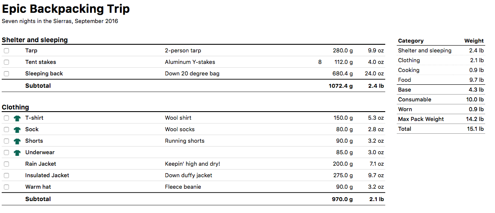

# Packlist - Backpacking Pack Lists for Geeks

Experienced backpackers know that a lighter pack helps you move faster and more comfortably, so you can enjoy the outdoors more. They also know that the best way to lighten your pack is by weighing and tracking every item. Only then can you seriously (and sometimes obsessively) evaluate what you should bring, what you should leave behind, and what you can substitute for a lighter or multiple use item.

Packlist can help you inventory and track your backpacking items and help you achieve that lighter pack. There are plenty of ways to do this, such as spreadsheets and the excellent site, [LighterPack](https://lighterpack.com).

Packlist is a bit different than these other options: It uses simple, and easy to read, text files to represent your pack's contents. (These files are actually small Ruby programs, but you needn't know any Ruby to use them).

Using text files has some advantages. You can create a master list of all your gear, then create a copy of that file and tailor it to a specific trip. You won't bring all the same gear on a summer trip as a winter trip, nor is the gear for a weekend in the Rockies the same as a AT thru hike. Packlist makes it easy to create lists tailored to your particular trip.

Additional, this is Packlist: Backpacking Lists for Geeks. The means outdoor loving geeks can use their favorite tools, like source control and their preferred text editor, to manage their pack lists.

## Installation

Install Packlist with the following command:

    gem install packlist

(Packlist requires Ruby to run. Mac OS X and most Linux distributions have Ruby pre-installed, and installers are available for Windows.)

## Creating a Pack List

Using your preferred text editor, create a file named `my_pack.rb` with the following contents:

    packlist do
      name "Epic Backpacking Trip"
      description "Seven nights in the Sierras"
    end

`name` and `description` can be anything you'd like.

### Add a category

After `description`, and before `end`, add your first category by inserting the following:

    category "Shelter and sleeping" do
    end

### Add an item

Between `category…do` and `end`, insert the following to add an item:

    item "Tent", "4-season, 3-person tent", 8.5.lb

This defined an item named "Tent", with description, "4-season, 3-person tent". It's weight is specified at 8.5 pounds. You may use other units of weight, by substituting "g", "kg", or "oz"—for grams, kilograms, or ounces, respective—for "lg". Examples:

* 1200.g = 1,200 grams
* 42.3.oz = 42.3 ounces
* 1.2.kg = 4.5 kilograms
* 2.65.lb = 2.65 pounds

Within a category, and with your pack, you may mix and match units of measure. Packlist will perform the appropriate conversions and calculations.

#### Specify Item Quantity

If you have multiple quantities of a given item (like tent stakes), specify the quantity after the unit weight:

    item "Tent stakes", "Aluminum Y-stakes", 14.g, 8

Note that the weight is per individual item; the line above adds eight tent stakes, with a weight of 14 grams each.

#### Specify Worn Items

Items that are regularly warn while hiking (such as a shirt, pants, or shorts) can be added as follows:

    worn "T-shirt", "Wool shirt", 150.g

Worn items do not count in your base weight, nor your maximum pack weight, but they do count towards your total weight (also known as "skin out weight").

Clothing that you will usually carry in your pack, such as a rain jacket, should be added with the `item` keyword:

    item "Rain Jacket", "2.5 layer lightweight jacket", 200.g

#### Specify Consumable Items

Items which are consumed, such as food and fuel, are added with the `consumable` or `food` keywords:

    consumable "Fuel", "All season fuel blend", 110.g
    food "Breakfast", "Oatmeal", 150.g, 7

(`food` is just an alias for `consumable`. You could use `consumable` for your breakfast, and even `food` for your fuel…but we don't recommend eating your fuel).

### Removing an Item from your list

Because your pack list is simply a text file, all you have to do to remove an item from your list is delete that line. Because it's also a Ruby program, you can also remove it by commenting out the line. Commented lines are ignored when Packlist runs and prepares your report.

Commenting out a line, rather than removing it, is helpful when your not sure if you'll bring an item or not, or when you're basing a list for a new trip off of a list from an old trip. Simply make a copy of the old list, and comment out items items that you won't need on this trip. And if you decide you do need that item, just un-comment the line.

Commented lines begin with a hash (#). Add a hash to the beginning of the line to comment the line out, and remove the hash to un-comment the line.

You may also leave comments to yourself in the pack list in the same way:

    # Do I want to bring my heavy tent, or my lightweight tarp?
    item "Tarp", "2-person tarp", 280.g
    # item "Tent", "4-season, 3-person tent", 8.5.lb

For a complete example of a pack list, see [this sample file](docs/sample_pack.rb).

## Usage

To generate an HTML report for your pack list, run the following command.

    packlist my_pack.rb

This will output a file named `my_pack.html`. You may open this in any modern browser (Safari, Chrome, or Firefox is recommended).

## Future Plans

* Add option to generate a PDF report.
* Add pie graph, showing relative weights for each category (similar to LighterPack)

## Acknowledgements

* Thanks to a reader on Backpackinglight.com for the initial idea.
* Thanks to [Galen Maley](http://www.galenmaly.com) for creating [LighterPack](https://lighterpack.com), which is an excellent resource for backpackers.
* Thanks to the many creators of the open source libraries used by Packlist.

## Contributing

New features and bug fixes are welcome. If you've got a bug report or feature request

1. Fork it ( https://github.com/jimothyGator/packlist/fork )
2. Create your feature branch (`git checkout -b my-new-feature`)
3. Write unit tests. Minitest Spec is preferred.
4. Commit your changes (`git commit -am 'Add some feature'`)
5. Push to the branch (`git push origin my-new-feature`)
6. Create a new Pull Request
